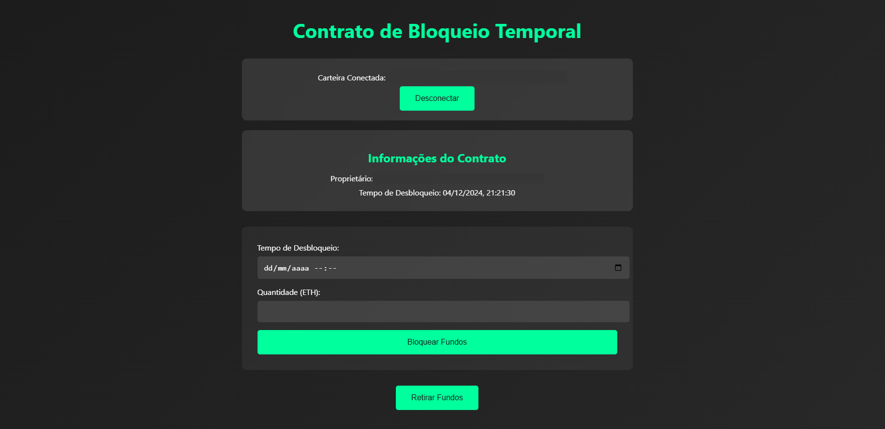

# Smart Contract --> Lock Project

Esse projeto implementa um contrato inteligente de bloqueio de fundos (time-lock) usando o framework Hardhat. O contrato permite que usuários bloqueiem ETH por um período específico, demonstrando os conceitos fundamentais de desenvolvimento de smart contracts.

## Funcionalidades 🚀

O contrato `Lock.sol` implementa as seguintes funcionalidades:

- **Bloqueio de Fundos**: Permite bloquear ETH por um período determinado
- **Retirada Temporizada**: Só permite a retirada dos fundos após o período de bloqueio
- **Controle de Propriedade**: Apenas o proprietário pode retirar os fundos
- **Eventos**: Emite eventos para rastrear retiradas

## Tecnologias Utilizadas 🛠️

- **Solidity**: Linguagem de programação para smart contracts
- **Hardhat**: Framework de desenvolvimento
- **Ethers.js**: Biblioteca para interação com a blockchain
- **Frontend**: React + Wagmi v2
- **Chai**: Framework de testes
- **Blockchain**: Ethereum
- **Carteira**: MetaMask

## Estrutura do Projeto 📁 

```
hardhat/
├── contracts/
│   └── Lock.sol          # Contrato principal
├── scripts/
│   └── deploy.js         # Script de implantação
├── test/
│   └── Lock.js           # Testes automatizados
└── hardhat.config.js     # Configuração do Hardhat
```

## Como Usar 🖥️

### Pré-requisitos

- Node.js (v14+ recomendado)
- npm ou yarn

### Instalação

1. Clone o repositório
2. Instale as dependências:
   ```bash
   npm install
   ```
 
### Comandos Principais ⚙️

- **Compilar os contratos**:
  ```bash
  npx hardhat compile
  ```

- **Executar os testes**:
  ```bash
  npx hardhat test
  ```

- **Iniciar rede local**:
  ```bash
  npx hardhat node
  ```

- **Implantar o contrato**:
  ```bash
  npx hardhat run scripts/deploy.js --network localhost
  ```

  
## Frontend 🎨

### Tela 1


### Tela 2


### Configure o Ambiente Local

## Testes ✅

O projeto inclui testes que verificam:

1. **Deployment**
   - Configuração correta do tempo de desbloqueio
   - Configuração correta do proprietário
   - Armazenamento correto dos fundos

2. **Validações**
   - Bloqueio de retiradas antes do tempo
   - Restrição de acesso apenas ao proprietário
   - Sucesso na retirada após o tempo de bloqueio

3. **Eventos**
   - Emissão correta do evento de retirada

4. **Transferências**
   - Transferência correta dos fundos ao proprietário

## Implantação 🌐

O contrato pode ser implantado em:

- Rede local Hardhat
- Redes de teste (Sepolia, Goerli)
- Rede principal Ethereum

O script de implantação (`scripts/deploy.js`) configura:
- Tempo de bloqueio (padrão: 1 minuto)
- Quantidade de ETH a ser bloqueada (padrão: 0.001 ETH)

## Segurança 🔒

O contrato implementa várias medidas de segurança:

- Verificação de tempo para retiradas
- Controle de acesso baseado em propriedade
- Validações de entrada

